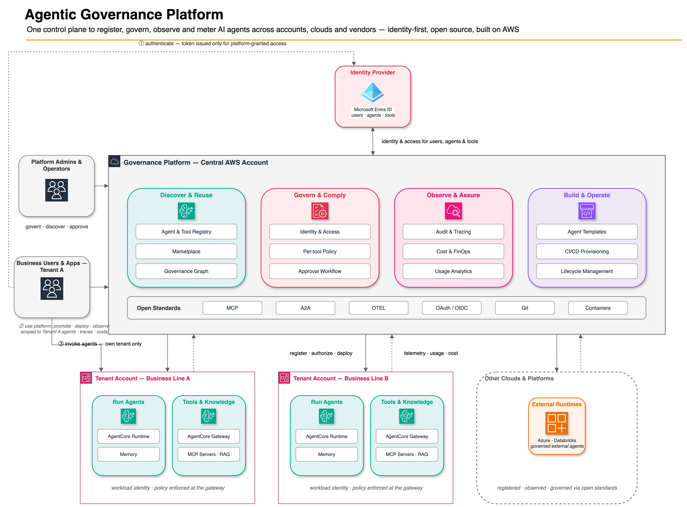

# Agentic Governance Platform

> An open-source, AWS-native control plane for governing AI agents across your enterprise — identity, access, policy, observability, and cost, all behind your own identity provider (currently Microsoft Entra ID).

The **Agentic Governance Platform (AGP)** answers a question every enterprise now faces: *as AI agents multiply across teams, clouds, and vendors, how do you see them all, control who can call what, and prove it to your security and compliance functions?*

AGP is a working, integrated answer — not slides. It is a self-hostable alternative to closed "agent control plane" products, built entirely on AWS and authenticated through **your own identity provider** — Microsoft Entra ID is the provider supported today, and additional providers are [roadmap](#roadmap). Users, agents, and tool servers are all first-class identities in *your* tenant; access between them is a standard Entra app-role assignment; fine-grained "which tool, with what arguments, under what conditions" is enforced with [AWS Cedar](https://www.cedarpolicy.com/). Nothing about identity is invented or held by the platform itself.

---

## What it does

AGP gives you one place to register, govern, observe, and pay for every agent in your estate:

| Capability | What you get |
|---|---|
| **Entra ID single sign-on** | Sign in through Microsoft Entra ID with your existing MFA and Conditional Access. The platform holds no passwords and runs no identity store of its own. |
| **Centralized agent registry** | A single searchable inventory of every agent — name, sponsor, business unit, region, data classification, lifecycle state, and the platform it runs on. |
| **Governed registration wizard** | Register a new agent in five steps — identity, sponsor, classification, target platform, confirm — and submit it for approval. It lands in the registry as a governed record; who may invoke it and which tools it may reach are set afterwards, from the agent's **Access** tab and the MCP server's Cedar policies. |
| **Access grants — users, agents, and tools** | Grant a user *or another agent* access to an agent from its **Access** tab. Agent-to-agent calls use the exact same Entra app-role mechanism as humans — no separate scheme. |
| **Cedar tool policies** | Per-tool authorization on the MCP gateway, expressed in plain language ("EU data only", "Read-only", "Business hours only") and compiled to Cedar. Toggle a policy off and the next call to that tool is blocked. |
| **Multi-MCP agents** | One agent can be granted and actively use several MCP (Model Context Protocol) servers at once, with per-server OBO tokens and namespaced tools. |
| **Governance graph** | An interactive node-link view of who can reach what — users/groups → agents → MCP servers — drawn live from Microsoft Entra, with policy-enforced edges badged. |
| **Live observability** | Per-agent traces, latency, errors, token usage, and cost via [Langfuse](https://langfuse.com/). Agents the platform deploys to **Amazon Bedrock AgentCore** are instrumented automatically — the runtime is handed its Langfuse endpoint and credentials at provision time. Runtimes on other platforms are not instrumented by the platform. |
| **Multi-vendor agent estate** | Register and govern agents from any platform side by side — AWS Bedrock, Azure, Salesforce, SAP, Databricks, Google, on-prem — each carrying a platform classification on its registry record, under one inventory and one access model. Agents are registered through the wizard or the API; automated inventory ingestion from vendor control planes is [roadmap](#roadmap). |
| **Cost attribution** | Real spend per agent, broken down by day, model, and calling user, from Langfuse's own token accounting — surfaced as a per-agent **Cost** tab and as a tenant-scoped platform aggregation. The business-unit / region / platform rollup, budgets, and ROI framing are [roadmap](#roadmap). |
| **Marketplace** | A consumer-facing catalog where users subscribe **themselves** to published agents, and subscribe **their agents** to MCP servers; an admin approves, and the platform applies the real, live Entra grant. The agent catalog is the agent registry itself — one card per published agent. |

### The governance model in one paragraph

There are three kinds of **principal**: **Users** (humans), **Agents** (workload identities), and **MCP Servers** (gateways exposing bundles of tools). All three are Entra ID principals, but only agents and MCP servers get an app registration of their own — minted by the platform, each carrying `Invoker`/`Admin` roles; users are your existing directory users, which the platform never creates or modifies. *"May this caller reach this target at all?"* is an Entra app-role assignment — the source of truth. Where it is enforced depends on the target: for an MCP server, at the gateway; for an agent, by Entra's own token endpoint refusing the on-behalf-of exchange and by the AgentCore runtime's inbound JWT authorizer. *"May this agent call this **specific tool**, with these arguments, under these conditions?"* is a **Cedar** policy, evaluated per call after the token is validated. Access itself is never copied: grants are read and written live in Microsoft Graph, so there is no local mirror to drift. Agent and MCP records live in the AWS Agent Registry; DynamoDB carries the platform's own domains — tenants, projects, connections, the marketplace, guardrail templates, and deployment metadata. There is no governance audit log yet; see [Roadmap](#roadmap).

### Roadmap

Named here because the capability table above deliberately does not claim them. The first two exist as designed UI behind an "Example design — not functional yet" banner, with no backend behind them.

- **Governance audit log** — an append-only record of every governance action, filterable by actor, target, and timeframe. `/govern/audit` is a design mock: there is no audit router among the 21 the backend registers, no audit service, and no audit table in the governance store.
- **FinOps rollup** — per-agent cost rolled up by business unit, region, and platform, with budgets, chargeback, forecasting, and ROI framing. `/govern/finops` is a design mock. The per-agent and per-tenant cost numbers in the table above are real and separate from this.
- **Automated inventory ingestion** — discovering agents from vendor control planes instead of registering them. No ingestion or discovery code exists today; the platform classification on a registry record is declared at registration.
- **Additional identity providers** — see the note under [Prerequisites](#prerequisites).

---

## Architecture

AGP runs in an admin/tooling AWS account and governs agents running in the same account or in separate target accounts. The control plane is a React + FastAPI web app; agents are deployed to **Amazon Bedrock AgentCore**; identity flows through **Microsoft Entra ID**; observability through **Langfuse**.



*This is a hand-maintained design drawing of the full vision: where it shows something the [Roadmap](#roadmap) lists as unbuilt — the FinOps rollup, the audit log, the externally-governed runtimes — the Roadmap is the accurate one.*

**Tech stack**

- **Frontend** — React 19, Vite, Tailwind, React Router 7, `@azure/msal-*` (Entra sign-in), `@xyflow/react` + dagre (governance graph), Recharts.
- **Backend** — FastAPI, Pydantic v2, boto3, DynamoDB, `PyJWT[crypto]` for Entra token validation, `httpx` against Microsoft Graph. Cedar policy text is compiled here and evaluated by the AgentCore Policy Engine on the gateway — the backend runs no Cedar engine of its own.
- **Identity** — Microsoft Entra ID: per-tenant app registrations, app roles, and Microsoft Graph as the system of record for access.
- **Runtime & observability** — Amazon Bedrock AgentCore for agent runtimes; Langfuse v3 + OpenTelemetry for tracing.

---

## Repository structure

```
agentic-governance-platform/
├── platform/                    # ★ The product — the governance control plane
│   ├── control_plane/
│   │   ├── backend/             # FastAPI — registry, grants, Cedar policy text, marketplace,
│   │   │                        #   graph aggregation, observability, Entra/Graph integration
│   │   ├── frontend/            # React + TS UI — registry, access tabs, governance graph,
│   │   │                        #   marketplace, observability, MSAL Entra sign-in
│   │   ├── infrastructure/      # Terraform — ECS, API Gateway, CloudFront, DynamoDB,
│   │   │                        #   Langfuse, Secrets Manager (Entra Graph client secret)
│   │   ├── agent-templates/     # Scaffolding templates for new governed agent repos
│   │   └── docs/                # Wiring the GitHub App the build pipeline uses
│   └── README.md                # Platform deep-dive (components, pipeline, deploy options)
│
├── docs/                        # ★ Design record + written guides — read this for the "why"
│   ├── README.md                # The documentation index — every guide, grouped, one line each
│   ├── *.md                     # The written guides, flat at this level — token propagation,
│   │                            #   registration, build and deploy, Cedar policies, Entra setup,
│   │                            #   tenant onboarding, services, data model, authorization layers
│   ├── high-level-architecture.png  # the architecture diagram rendered above
│   └── project-history.md       # How it was built — decisions, detours, where it stands
│
├── applications/                # ★ Example runtime agents governed by the platform —
│   └── acme_*_agent/            #   each reads its MCP servers, delegated-token provider,
│                                #   and observability wiring from platform-injected env vars
│                                #   (see applications/README.md for the full contract)
│
├── LICENSE, NOTICE              # Apache-2.0
└── README.md
```

The three directories that matter most:

- **[`platform/`](platform/)** — the platform itself. This is where the engineering lives: the control-plane backend, the React UI, the Terraform, and every governance feature listed above. Start at [`platform/README.md`](platform/README.md) for the component-level deep dive, the governance model, and the deploy options.
- **[`applications/`](applications/)** — example runtime agents ready to be governed by the platform. They show the configuration contract every governed agent follows: the platform injects the agent's granted MCP servers (`MCP_SERVERS` JSON), the delegated-token credential provider (`CREDENTIAL_PROVIDER_NAME`), and Langfuse observability wiring — all as environment variables, so agents carry no hardcoded gateway URLs or credentials. See [`applications/README.md`](applications/README.md) for the full contract and per-agent runbooks.
- **[`docs/`](docs/)** — the design record. Every feature was designed just-in-time as an "epic" with a locked spec and a contract-heavy plan. [`docs/project-history.md`](docs/project-history.md) reads as a chronological history of what was built and why.

---

## Prerequisites

All of this must exist **before** you configure the repo. A single AWS account is enough.

**AWS**

- An AWS account, with credentials configured such that `aws sts get-caller-identity` succeeds, and permission to create IAM roles, VPC/ECS/CloudFront resources, DynamoDB tables, and Secrets Manager secrets.
- The region exported. The stack is built and tested against `us-east-1`; the account and region are taken from your ambient credentials, never from a file in the repo.

  ```bash
  export AWS_REGION=us-east-1
  export AWS_DEFAULT_REGION=us-east-1
  ```

**A Microsoft Entra ID tenant** in which you can create app registrations and **grant admin consent** for Microsoft Graph application permissions. A free Microsoft 365 developer tenant is sufficient.

> **On identity providers:** Entra ID is the only identity provider AGP supports today, and the whole authorization model is built on Entra app-role assignments. Support for additional providers (Okta, for example) is on the roadmap — it is not implemented, and there is no date.

**Tooling on the machine that runs the deploy**

- **AWS CLI v2 — and a recent one.** Not just any v2: the post-apply seed step in step 6 runs `aws agent-registry-control list-registries`, and AWS only split the Agent Registry into that service namespace on **2026-08-06** (`platform/control_plane/infrastructure/README.md` explains why there is still no Terraform resource for it). An older v2 does not have the command at all and answers `Invalid choice: 'agent-registry-control'`, which reads like a permissions or region problem and is neither. Check with `aws --version` and update if it is more than a few weeks old.
- **Terraform >= 1.15** (the floor declared in `platform/control_plane/infrastructure/main.tf`).
- **Node.js and npm** — the frontend is built locally and synced to S3.
- **Docker or [finch](https://runfinch.com/), running.** Not optional: the Langfuse module mirrors container images from Docker Hub into your own ECR *during* `terraform apply`, so the apply fails partway through without a container engine. `deploy-full.sh` resolves docker-or-finch automatically; pass `--finch` to force finch.
- **`jq` and `python3`.**
- **The backend virtualenv, created before the first apply.** Terraform creates the two agent registries by running a bootstrap script through `../backend/venv/bin/python`, and a plan-time precondition fails with a named error if that interpreter is absent. The venv is gitignored, so a fresh clone does not have one:

  ```bash
  cd platform/control_plane/backend
  python3 -m venv venv && venv/bin/pip install -r requirements.txt
  ```

`deploy-full.sh` re-checks AWS credentials, the container engine, Terraform, and Node before it does anything, and stops with a specific error if one is missing.

---

## Bootstrapping

Steps 1–3 are configuration, step 4 deploys, steps 5–7 finish the job. Steps 1 and 5 are a loop: the Entra redirect URI cannot be known until AWS has handed you a CloudFront domain.

### 1. Create the Entra app registrations

Nothing in this repo touches your tenant unless you choose to run the optional setup script — either way you create two app registrations, once, and copy their identifiers into the two config files in steps 2 and 3.

**Two ways to get there.** Run [`scripts/entra-setup/setup_entra.py`](scripts/entra-setup/README.md): it creates both registrations with everything they carry, grants the admin consents, assigns you a platform role, and prints every **Entra** value steps 2 and 3 need. It requires the Azure CLI and an admin sign-in (`az login`), writes nothing to disk, and has a `--dry-run` mode to start with. Or follow the guide and click through the portal yourself — the values you come back with are the same either way.

**[`docs/entra-setup.md`](docs/entra-setup.md) is the manual walkthrough** — screen-by-screen, with fill-in templates for every value, plus a troubleshooting table for when sign-in misbehaves. What you come back with:

**a. From the backend app registration** — a confidential client. It is the API every token is issued for, and it carries the three platform roles and the Graph permissions:

| Value | Where it goes |
|---|---|
| Application (client) ID | `entra_backend_client_id` |
| Client secret **value** | `entra_backend_client_secret` |
| Application ID URI, e.g. `api://agp` | `entra_audience` |
| Exposed delegated scope, e.g. `Access.Default` | the scope half of `VITE_ENTRA_SPA_SCOPE` |

**b. From the SPA app registration** — the public MSAL client the browser signs in with:

| Value | Where it goes |
|---|---|
| Application (client) ID | `entra_spa_client_id` and `VITE_ENTRA_SPA_CLIENT_ID` |
| A redirect URI | not knowable yet — **step 5** |

**c. From the tenant itself** — the tenant ID (a GUID) for `entra_tenant_id` / `VITE_ENTRA_TENANT_ID`, and the tenant domain (`<something>.onmicrosoft.com`) for `VITE_ENTRA_TENANT_DOMAIN`.

Two things bite if skipped, and the guide covers both: the platform roles belong on the **backend** app registration — defined or assigned on the SPA one they are a silent no-op — and **at least one user must be assigned a platform role**, or that user's first sign-in ends in a refusal that looks like a platform bug and is not one.

### 2. Configure the infrastructure

```bash
cd platform/control_plane/infrastructure

cp terraform.tfvars.example terraform.tfvars
cp secrets.auto.tfvars.example secrets.auto.tfvars
```

`terraform.tfvars` ships with defaults that work as-is for a single-account dev deploy. Most people only touch `aws_region`, `environment`, `project_name`, and the optional `domain_name` / `hosted_zone_id` pair (leave `hosted_zone_id` empty and you get the CloudFront domain instead of a custom one).

`secrets.auto.tfvars` is the file that carries your Entra values. Terraform **auto-loads any `*.auto.tfvars`** in this directory, so there is no `-var-file` flag to remember. Fill in:

| Key | Value |
|---|---|
| `auth_provider` | optional — `entra` is the only accepted value and also the default |
| `entra_tenant_id` | tenant GUID |
| `entra_audience` | the backend app's Application ID URI |
| `entra_spa_client_id` | SPA app's client ID |
| `entra_backend_client_id` | backend app's client ID |
| `entra_backend_client_secret` | backend app's client secret **value** |
| `langfuse_admin_password` | seed password for the Langfuse admin user (letters, numbers, at least one special character) |
| `langfuse_admin_email` | seed Langfuse admin login |

`entra_backend_client_secret` is the **only root variable with no default.** Omit it and `terraform apply` stops on a bare interactive prompt that explains nothing. Both `*.tfvars` files are gitignored (`**/*.tfvars`); confirm with `git check-ignore -v secrets.auto.tfvars`.

**The audience has to match in three places.** `entra_audience`, the Application ID URI in Entra, and the URI half of `VITE_ENTRA_SPA_SCOPE` must be byte-identical. The value itself is yours to pick; the examples use `api://agp`. When they disagree, every API call returns 401 and nothing in the response says which side is wrong.

### 3. Configure the frontend

```bash
cd platform/control_plane/frontend
cp .env.example .env
```

`.env` is the file to fill in, but it is not the file the production build reads. `deploy-full.sh` reads `.env` and regenerates `frontend/.env.production` from it, and `.env.production` is what Vite actually builds the bundle from. That distinction only bites once — in step 5, which says what to do about it. The SPA declares exactly seven variables, and reads six of them:

| Variable | Value |
|---|---|
| `VITE_API_URL` | the deployed API Gateway URL — **from `terraform output` after step 4** |
| `VITE_AUTH_PROVIDER` | `entra` — must match the backend's `AUTH_PROVIDER`; nothing in the SPA reads it |
| `VITE_ENTRA_TENANT_ID` | tenant GUID |
| `VITE_ENTRA_TENANT_DOMAIN` | `<something>.onmicrosoft.com` |
| `VITE_ENTRA_SPA_CLIENT_ID` | SPA app's client ID |
| `VITE_ENTRA_SPA_REDIRECT_URI` | **from step 5** |
| `VITE_ENTRA_SPA_SCOPE` | `<application-id-uri>/<scope-name>`, e.g. `api://agp/Access.Default` |

Fill in the five you already know now; the other two come from the first deploy. `VITE_ENTRA_TENANT_ID` and `VITE_ENTRA_SPA_CLIENT_ID` are not optional: the SPA throws at module load if either is missing or still an all-zero placeholder, because the alternative is a sign-in that completes against the wrong directory and then fails every API call.

### 4. Deploy

```bash
cd platform/control_plane/infrastructure/scripts
./deploy-full.sh          # add --finch to force the finch container engine
```

Five stages: Terraform, backend image build + push to ECR, ECS rolling deploy, frontend build, frontend deploy to S3 + CloudFront. It **pauses after `terraform plan` and waits for you to type `yes`**, so you review the plan before anything is created.

**One apply is enough.** The agent and MCP registries are created by Terraform and resolved by *name* at runtime, so there is no registry id to read back, paste anywhere, or re-apply for.

### 5. Close the redirect-URI loop

This is a genuine chicken-and-egg, and it is where sign-in silently breaks. The SPA's redirect URI is a CloudFront domain that does not exist until Terraform has run — so you deploy first, then repoint both sides:

```bash
cd platform/control_plane/infrastructure
terraform output -raw frontend_url    # e.g. https://d111111abcdef8.cloudfront.net
terraform output -raw api_endpoint     # e.g. https://abc123.execute-api.us-east-1.amazonaws.com/dev
```

1. In the **SPA app registration**, add `<frontend_url>/auth/callback` as a redirect URI (platform: Single-page application).
2. In `platform/control_plane/frontend/.env`, set `VITE_ENTRA_SPA_REDIRECT_URI` to that same `<frontend_url>/auth/callback`, and `VITE_API_URL` to the `api_endpoint` value. That is their durable home and the file `deploy-full.sh` reads.
3. Ship them, one of two ways — **and read the note below before picking, because one obvious-looking route silently does nothing:**

   ```bash
   cd platform/control_plane/infrastructure/scripts
   ./deploy-full.sh        # re-reads .env, regenerates .env.production, redeploys everything
   ```

   or, for a frontend-only redeploy, copy the same two values into `frontend/.env.production` as well and then:

   ```bash
   cd platform/control_plane/infrastructure/scripts
   ./deploy-frontend.sh
   ```

Until **both** sides point at the same URI, sign-in fails with no useful error. This repeats every time the CloudFront domain changes — for example after a destroy-and-recreate.

> **Which env file the build actually reads.** Step 4 wrote all seven variables into `frontend/.env.production`, and for a production build Vite ranks the env files in ascending priority `.env` → `.env.local` → `.env.production` → `.env.production.local`. So `.env.production` beats the `.env` you filled in at step 3.
>
> `deploy-full.sh` handles that for you: for the five operator-supplied variables it deliberately reads `.env` *before* `.env.production` — because `.env.production` is its own previous output and a stale generated value must never beat a hand-edit — and then rewrites all seven keys. `deploy-frontend.sh` does not: it runs `npm run build` and generates nothing, so Vite's order applies unchanged.
>
> **Editing only `.env` and then running `deploy-frontend.sh` therefore changes nothing, and reports nothing.** The build succeeds and ships the previous values. If you use a custom domain or a non-default callback path, that is the mistake that deploys a bundle nobody can sign in to. `.env.production` carries a "do not hand-edit" header for good reason — a later `deploy-full.sh` overwrites it from `.env` — which is why step 2 puts the values in `.env` first and `.env.production` is only the copy that makes the quick path work.

### 6. Seed the default tenant — and, optionally, demo data

**A tenant is not optional; the script that creates one is.** An admin can create a tenant through the API or the UI instead, but until one exists the platform cannot register an agent (`POST /agents` answers `400 unknown tenant`), cannot create a project, and refuses every runtime build with `unknown tenant or stage`. Steps 2 and 3 below *are* optional — they populate the registry, the marketplace, and the demo MCP gateways so the UI has something credible in it.

All of these run from the backend directory and need `PYTHONPATH=src`, because `src/` is not a package:

```bash
cd platform/control_plane/backend
```

1. **`seed_default_tenant.py`** — creates a tenant named **`Default-Platform`** whose dev and prod stages both point at the platform's own AWS account, so agents deploy right where the platform runs — ideal for a demo or a single-account install — and wires its ECR/deploy-role configuration. The full command, with the `aws agent-registry-control list-registries` lookups that turn the Terraform registry-*name* outputs into ids, is documented verbatim at the top of [`platform/control_plane/infrastructure/modules/default_tenant/main.tf`](platform/control_plane/infrastructure/modules/default_tenant/main.tf) — copy it from there. The one value you must supply yourself is `--group-id`, an Entra **group object ID** for tenant membership. Idempotent.
2. **`seed_agents.py`** and **`seed_mcp_servers.py`** — representative demo agents and MCP servers. Each takes `--registry-id`; both print the lookup command if you omit it, and both accept `--dry-run` for an offline check.

   ```bash
   PYTHONPATH=src venv/bin/python scripts/seed_agents.py --dry-run
   ```
3. **`bootstrap_demo_use_cases.py`** — stands up three real AgentCore demo gateways (contact center, FNOL, insurance support) with their Lambdas and IAM roles. Idempotent, namespaced to `agp-*`, and also supports `--dry-run`.

### 7. Sign in

Open the `frontend_url` from step 5, sign in through Microsoft Entra ID, and the platform loads with the role your Entra assignment gives you. From there: register agents, grant access, and author tool policies from the UI.

`terraform destroy` from `platform/control_plane/infrastructure` tears the stack down, but teardown currently needs supervision and can leave resources behind on the first pass.

> Deploy options, the Langfuse observability setup, and cross-account deployment are documented in [`platform/README.md`](platform/README.md).

---

## Development

Both test suites run from a fresh clone with no AWS credentials and nothing deployed.

**Backend** — the same venv the [Prerequisites](#prerequisites) describe, plus the test dependencies:

```bash
cd platform/control_plane/backend
python3 -m venv venv && venv/bin/pip install -r requirements.txt -r requirements-dev.txt
PYTHONPATH=src venv/bin/python -m pytest -q
```

`requirements-dev.txt` is what adds `pytest`, `pytest-asyncio`, and `moto`. The venv command in the Prerequisites installs `requirements.txt` only — enough to deploy, not enough to run the tests — so if you created the venv there, run the `pip install` line above again. `backend/pyproject.toml` sets `pythonpath = ["src"]` for pytest, so a bare `venv/bin/python -m pytest -q` works too and collects identically; the `PYTHONPATH=src` prefix above is what the `scripts/` one-shots still need, because `src/` is not a package. Current: **3275 passed, 6 skipped**, about 60 seconds.

**Frontend** — five gates, all from `platform/control_plane/frontend`:

```bash
npm ci
npx tsc -b            # types
npx vitest run        # 44 files, 1290 tests
npm run build         # tsc -b + vite build
npm run lint          # eslint — read the note below before reacting to the number
npm audit --omit=dev  # expects 0 vulnerabilities
```

The Vitest suite is **node-environment only by design** (`include: ['src/**/*.test.ts']`) — there are no `.tsx` tests, no DOM, and no render harness. Component wiring is covered by `npm run build` and by deploying and clicking, not by unit tests.

`npm run lint` reports **63 problems (59 errors, 4 warnings) and exits 1.** That is a known, accepted baseline rather than new debt — mostly `react-hooks/set-state-in-effect` and `react-refresh/only-export-components` in long-lived files, itemised rule by rule in the frontend README. Treat the number as the bar: a change should not raise it.

---

## Documentation

| Where | What you'll find |
|---|---|
| [`docs/README.md`](docs/README.md) | **Start here** — the documentation index: every written guide, grouped, with a one-line hook each |
| [`platform/README.md`](platform/README.md) | Control-plane components, deployment pipeline, observability, deploy options |
| [`applications/README.md`](applications/README.md) | Example governed agents — the runtime env contract (MCP servers, OBO tokens, observability) and deploy runbooks |
| [`docs/project-history.md`](docs/project-history.md) | How it was built — the build history, decisions, and detours, epic by epic |
| [`docs/high-level-architecture.png`](docs/high-level-architecture.png) | The high-level architecture diagram — the same render shown under [Architecture](#architecture). The written guides that pair with it sit at the `docs/` root: the [AWS service inventory](docs/services.md), the [data model](docs/data-model.md), and the [authorization layers](docs/authorization-layers.md) |
| [`docs/token-propagation.md`](docs/token-propagation.md) | Every hop a caller's token takes from sign-in to a tool call: validation, the two On-Behalf-Of exchanges, what is never logged, and a failure catalog |
| [`docs/agentcore-registration.md`](docs/agentcore-registration.md) | What registering an agent or an MCP server provisions: the record, the lifecycle states, the identity-minting timeline, and grants |
| [`docs/agent-deployment.md`](docs/agent-deployment.md) | How an agent is deployed: GitHub builds the container image, the platform deploys it into the tenant's account, and reaching production is a human decision |
| [`docs/cedar-tool-policies.md`](docs/cedar-tool-policies.md) | Per-tool authorization at the gateway: the policy model, what it can express, who evaluates it, and what a deny looks like |
| [`docs/entra-setup.md`](docs/entra-setup.md) | Setting up Microsoft Entra ID screen by screen: the two app registrations in twelve steps with fill-in templates, where every value goes, and a troubleshooting table |
| [`docs/tenant-account-onboarding.md`](docs/tenant-account-onboarding.md) | What a tenant is, what an AWS account must already have before it can host agents, and how to create a tenant |

---

## License

See [LICENSE](LICENSE) and [NOTICE](NOTICE).
