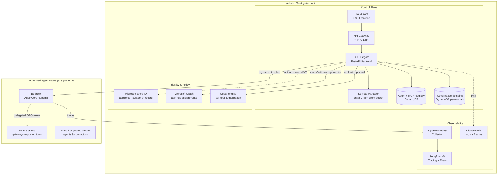

# Platform

The platform layer is the **governance control plane** — the unified web surface operators use to register,
govern, observe, and pay for every AI agent in their estate. Users, agents, and MCP (tool) servers are all
first-class identities in your own **Microsoft Entra ID** tenant; access between them is a standard Entra
app-role assignment; fine-grained "which tool, with what arguments, under what conditions" is enforced with
[AWS Cedar](https://www.cedarpolicy.com/). Nothing about identity is invented or held by the platform itself.

---

## Architecture

The platform runs in an admin (tooling) AWS account and governs agents running in the same account or in
separate target accounts. The control plane is a React + FastAPI web app; identity flows through Microsoft
Entra ID; per-tool authorization is evaluated with Cedar; observability flows through Langfuse.

---

## Components

### Control Plane

The React + FastAPI web UI for registering, governing, observing, and paying for every agent.

| Component | Description |
|-----------|-------------|
| [Backend](control_plane/backend/) | FastAPI API — agent registry, MCP server registry, access grants (Entra app-role assignments), Cedar per-tool policies, governance graph aggregation, marketplace, Microsoft Graph integration, Langfuse provisioning. |
| [Frontend](control_plane/frontend/) | React + TypeScript UI — agent registry, registration wizard, access tabs, Cedar policy editor, governance graph (`@xyflow/react` + dagre), marketplace, observability, MSAL Entra sign-in. |
| [Infrastructure](control_plane/infrastructure/) | Terraform modules — full control plane stack: ECS, API Gateway, CloudFront, DynamoDB, **Secrets Manager** (Entra Graph client secret), `agent_registry`, CodeBuild, and the Langfuse v3 observability stack (`modules/langfuse/`). |
| [Agent templates](control_plane/agent-templates/) | Scaffolding templates for new governed agent repositories (Strands-on-AgentCore), used by the platform's repo-creation flow. |

### Governance model

There are three kinds of **principal**: **Users** (humans), **Agents** (workload identities), and **MCP Servers**
(gateways exposing bundles of tools). All three are Entra ID principals with their own app registration and
`Invoker`/`Admin` roles.

- **Agent registry** — a single searchable inventory of every agent: name, sponsor, business unit, region, data
  classification, lifecycle state, and the platform it runs on.
- **Registration wizard** — register a new agent in five steps (identity, sponsor, classification, target
  platform, confirm) and submit it for approval. It appears in the registry as a governed record; invokers and
  tool policies are set afterwards, from the **Access** tab and the MCP server's Cedar policies.
- **Access grants** — grant a user *or another agent* access to an agent from its **Access** tab. Agent-to-agent
  calls use the exact same Entra app-role mechanism as humans — read and written live through Microsoft Graph,
  with no local mirror to drift.
- **Cedar tool policies** — per-tool authorization on the MCP gateway, authored in plain language ("EU data
  only", "Read-only", "Business hours only") and compiled to Cedar. Toggle a policy off and the next call to
  that tool is blocked.
- **Multi-MCP agents** — one agent can be granted and actively use several MCP servers at once, with per-server
  On-Behalf-Of (OBO) tokens and namespaced tools.
- **Governance graph** — an interactive node-link view of who can reach what (users/groups → agents → MCP
  servers), drawn live from Microsoft Entra, with policy-enforced edges badged.
- **Marketplace** — a consumer-facing catalog where users subscribe **themselves** to published agents and
  subscribe **their agents** to MCP servers; an admin approves, and the platform applies the real, live Entra
  grant. The agent catalog is the agent registry itself — one card per published agent.

### Authentication

Sign-in is through **Microsoft Entra ID** (MSAL v5 in the frontend, JWT validation in the backend); the platform
holds no passwords and runs no identity store of its own. The live inbound path is `core/rbac.py`, which
dispatches between a local **dev-auth** header bypass (`USE_DEV_AUTH`/`DEBUG`) and real Entra JWT validation in
`core/security_entra.py` — Entra is the sole real provider.
Outbound Microsoft Graph calls use the **Backend Graph Client** secret stored in Secrets Manager and fetched at
runtime from ECS.

### Observability

First-class Langfuse + OpenTelemetry integration.

- The **`modules/langfuse/`** Terraform module provisions Langfuse v3 on ECS Fargate with managed PostgreSQL
  (Aurora), Redis (ElastiCache), and ClickHouse — along with the networking required to support it. It is
  applied as part of the root `terraform apply`.
- The control plane provisions per-agent Langfuse projects, stores their API keys in Secrets Manager, and surfaces
  per-agent traces, latency, errors, and token usage. The wiring is **injected automatically for agents on the
  Bedrock AgentCore runtime**; an agent running anywhere else is registered and governed exactly the same way,
  but has to ship its own traces to the Langfuse host before it appears here.
- The **Observability** page opens on a native **Dashboard** tab rendered from the backend's
  `/observability/*` routes (E26 replaced the bare Langfuse iframe embed). A secondary **Langfuse** tab
  still tries to frame the Langfuse host directly and degrades to an "Open in New Tab" link when
  Langfuse's `X-Frame-Options` refuses the embed — which is the common case, so treat the native
  dashboard as the surface and the tab as a shortcut.
- CloudWatch Logs capture ECS + Lambda + CodeBuild output; alarms fire on ECS CPU/memory and pipeline failures.

---

## Deploying

**The setup path lives in the [root README](../README.md), and only there.** Read
[Prerequisites](../README.md#prerequisites) and [Bootstrapping](../README.md#bootstrapping) and follow them
in order: the two Entra app registrations you create **by hand** (nothing in this repo provisions your
tenant), `terraform.tfvars` and `secrets.auto.tfvars` from their `.example` files, the frontend `.env`, one
`terraform apply`, then the redirect-URI loop that cannot be closed until AWS has handed you a CloudFront
domain. Those steps are deliberately not repeated here — a third copy is a third thing to drift.

What follows is what the root README forwards here for: the deploy options, the Langfuse observability
setup, and cross-account deployment. For the Terraform-level runbook — module reference, post-apply steps,
remote state migration, teardown, troubleshooting — see
[`control_plane/infrastructure/README.md`](control_plane/infrastructure/README.md).

### Deploy options

Every script below lives in `control_plane/infrastructure/scripts/` and is safe to run from any working
directory; each one `cd`s to the infrastructure root before invoking Terraform.

| Command | What it does | When to reach for it |
|---|---|---|
| `./deploy-full.sh` | Five stages: Terraform, backend image build + push to ECR, ECS rolling deploy, frontend build, frontend deploy to S3 + CloudFront. Preflights AWS credentials, the container engine, Terraform and Node before touching anything, and pauses after `terraform plan` for a typed `yes`. | The first deploy, and after pulling new code. Add `--finch` to force finch over docker. |
| `terraform apply` from `control_plane/infrastructure` | Infrastructure only. | Reviewing or iterating on infra alone. Expect the backend ECS service to sit at **0 running tasks** afterwards: the task definition points at an ECR repo with no image yet, the deployment circuit breaker rolls it back, and the apply still reports success. Pushing the image converges it. |
| `./deploy-container.sh` | Backend image only — builds `linux/amd64`, pushes to ECR, then forces a new ECS deployment. Assumes Terraform has already provisioned ECR + ECS. | Backend code changed. |
| `./deploy-frontend.sh` | Frontend only — builds the UI **as-is** from whatever `frontend/.env*` files are present, syncs to S3, invalidates CloudFront. It generates no env files. | Frontend code changed, and after editing `frontend/.env` to close the redirect-URI loop. |
| `./setup-dockerhub-auth.sh` | Stores Docker Hub credentials in Secrets Manager so the Langfuse image mirror is not subject to anonymous pull rate limits. | Optional, before the first apply. |
| `./import-existing.sh` | Imports pre-existing AWS resources into Terraform state. | Recovering from a partial failure, or adopting manually-created resources. |
| `./destroy.sh` | Tears down everything this Terraform state owns, emptying S3 buckets first so the destroy does not stall on them. Double-confirms. | Resetting a dev environment. Teardown still needs supervision and can leave resources behind on the first pass. |

`deploy-full.sh`, `destroy.sh`, `import-existing.sh` and `setup-dockerhub-auth.sh` are documented in full —
modes, environment variables, troubleshooting — in
[`control_plane/infrastructure/scripts/README.md`](control_plane/infrastructure/scripts/README.md).

### Langfuse observability setup

**There is nothing separate to deploy.** Langfuse v3 is a base Terraform module applied by the root
`terraform apply`: `modules/langfuse/` stands it up on ECS Fargate with Aurora PostgreSQL, ElastiCache
Redis, ClickHouse, an ALB and a CloudFront distribution, plus the networking they require. It is not a
separately-provisioned stack and there is no second apply.

Three things about it are worth knowing before the first apply:

- **It needs a running container engine with Docker Hub egress on the apply host.** The module mirrors its
  upstream images into your own ECR *during* the apply (`modules/langfuse/mirror-image.sh`), so with no
  engine reachable `terraform apply` fails partway through rather than up front. Force the engine with
  `CONTAINER_ENGINE=finch terraform apply`, or `deploy-full.sh --finch`.
- **The seed admin login comes from your tfvars** — `langfuse_admin_email` and `langfuse_admin_password`
  in `secrets.auto.tfvars` (the password needs letters, numbers, and at least one special character).
- **The image tags are pinned, so bump them on a schedule.** `modules/langfuse/ecr.tf` pins
  `langfuse_version` and `clickhouse_version`. This is a long-lived internet-facing service, so a
  pinned-and-forgotten image is exposed rather than merely stale; the mirror step is a no-op when the tag
  is already in ECR, which makes a bump cheap.

Once it is up, the control plane provisions a Langfuse project per agent, stores that project's API keys in
Secrets Manager, and injects the host and keys into the agent's runtime environment — so a governed agent
is observable with no manual wiring. Traces are read back **through the backend**, not out of Langfuse
directly: `/observability/*` for platform- and tenant-scoped metrics, `/agents/{id}/metrics` and
`/agents/{id}/traces` for one agent.

Operator notes, the image-currency policy, and the provider requirements are in
[`control_plane/infrastructure/modules/langfuse/README.md`](control_plane/infrastructure/modules/langfuse/README.md).

### Cross-account deployment

> **Wired, but not tested end-to-end.** Single-account is the configuration this stack is deployed and
> tested against. The two-account path below is real code with real IAM scoping, and it sits on the
> known-limitations list precisely because nobody has run it from zero. Read it as the design, not as a
> supported runbook.

The control plane itself always runs in one admin/tooling account. What can move to a separate target
(tenant) account is the **agent runtime**:

- `modules/agentcore_runtime` takes a `deploy_role_arn`. When it is set, the module's own provider assumes
  that role, so the AgentCore runtime and its execution role are created in the tenant account — and the
  module reads `aws_caller_identity`/`aws_region` from that same provider, so every ARN it scopes resolves
  in the account the runtime actually runs in. No account id is hardcoded anywhere.
- The platform's CodeBuild role is scoped to `sts:AssumeRole` on `arn:aws:iam::*:role/agp-deployment-*`,
  and `modules/default_tenant` provisions exactly one such role — `agp-deployment-<prefix>-default` — in
  the admin account. That is what makes the single-account default a degenerate case of the same
  mechanism rather than a second code path.
- `modules/agent_ecr` accepts `replication_destination_account_id` (plus an optional destination region)
  to replicate agent images into the tenant account. It is deliberately unset for a single-account
  deploy, because ECR rejects a same-account, same-region replication rule at apply time. Note that this
  is a *module* input with no root variable behind it: the root's `module "agent_ecr"` block passes no
  replication argument, so turning it on means editing `main.tf`, not adding a line to `terraform.tfvars`.

---

## Related

- [Applications](../applications/) — example runtime agents (`acme_*_agent`) governed by the platform,
  including the env-var contract every governed agent follows (MCP servers, OBO tokens, observability).
- [`docs/project-history.md`](../docs/project-history.md) — how the platform was built, which decisions
  shaped it, and what was tried and abandoned along the way.
- [`docs/high-level-architecture.png`](../docs/high-level-architecture.png) — the high-level
  architecture diagram: the control plane, tenant accounts, and identity flows on one page.
